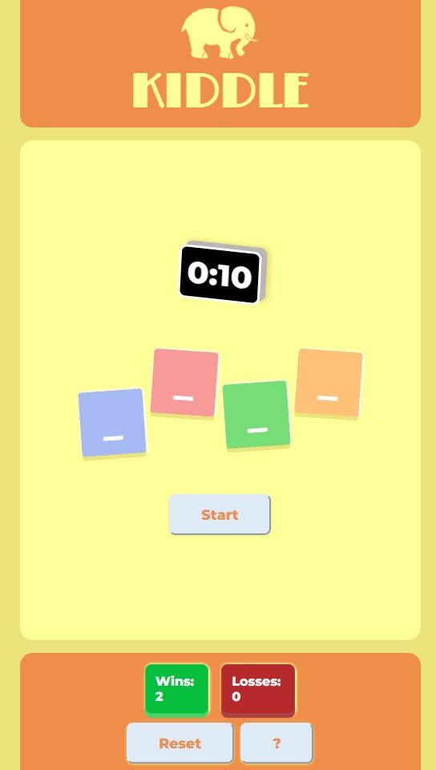

# Word Guess

  

## Description

Guess the word! This game is super fun to play. I created this game to illustrate the importance of APIs.

## Usage

Click on [Word Guess](https://leoelicos.github.io/bcs-04-word-guess/). The App will run on any browser.

## Screenshots

### Word Guess

## Credits

-  BCS Resources

## License

&copy; Leo Wong <leoelicos@gmail.com>

Licensed under the [MIT License](./LICENSE).

---
